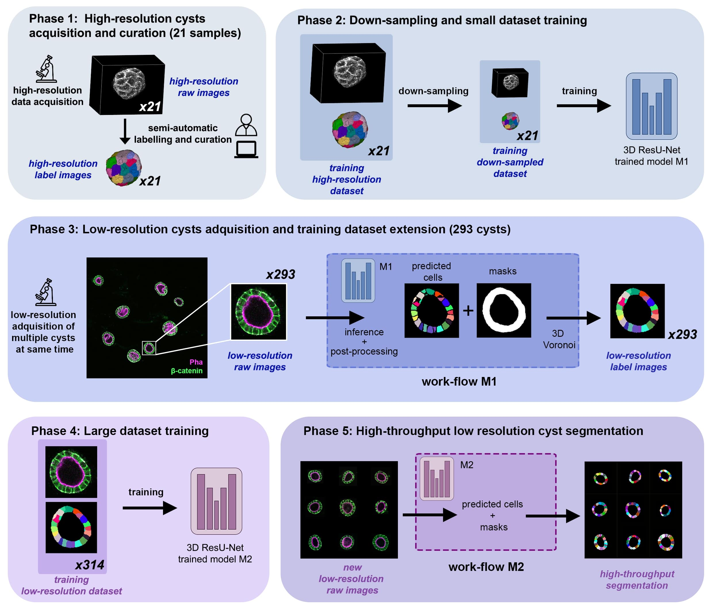

This tutorial describes how to train and infer using our custom ResU-Net 3D DNN in order to reproduce the results obtained in ``(Andrés-San Román, 2022)``. Given an initial training dataset of 21 segmented epithelial 3D cysts acquired after confocal microscopy, we follow the CartoCell pipeline (figure below) to high-throughput segment hundreds of cysts at low resolution automatically.

<div class="row">
    
</div>

Citation: 

```
Andres-San Roman, Jesus A., et al. "CartoCell, a high-content pipeline for 3D image analysis, unveils cell morphology patterns in epithelia." Cell Reports Methods 3.10 (2023).
```