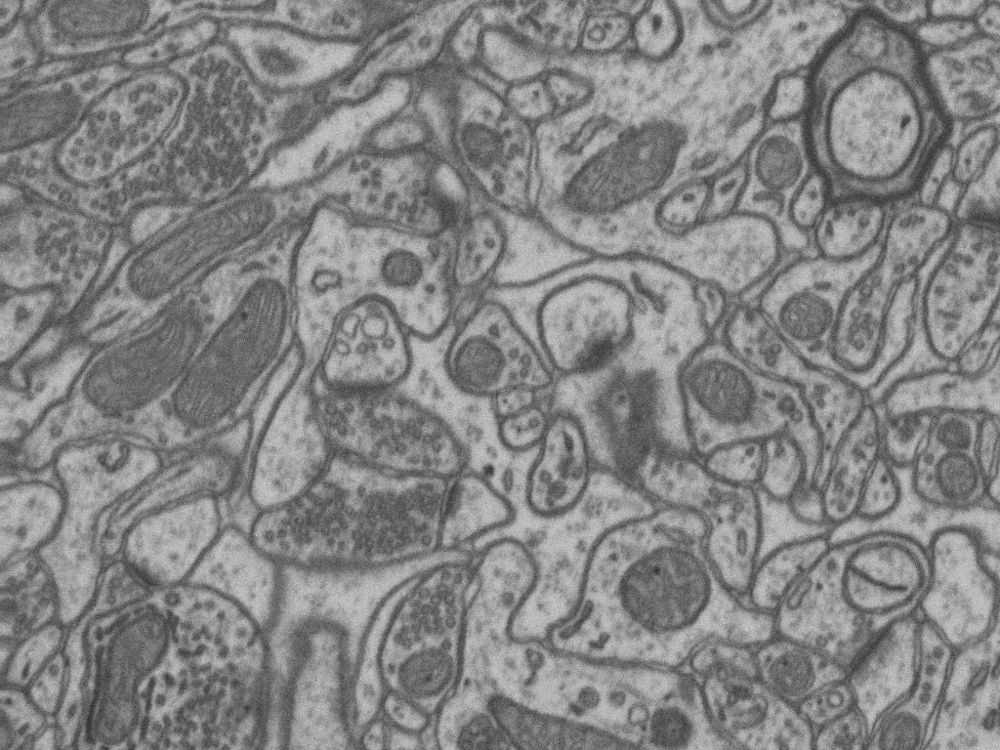
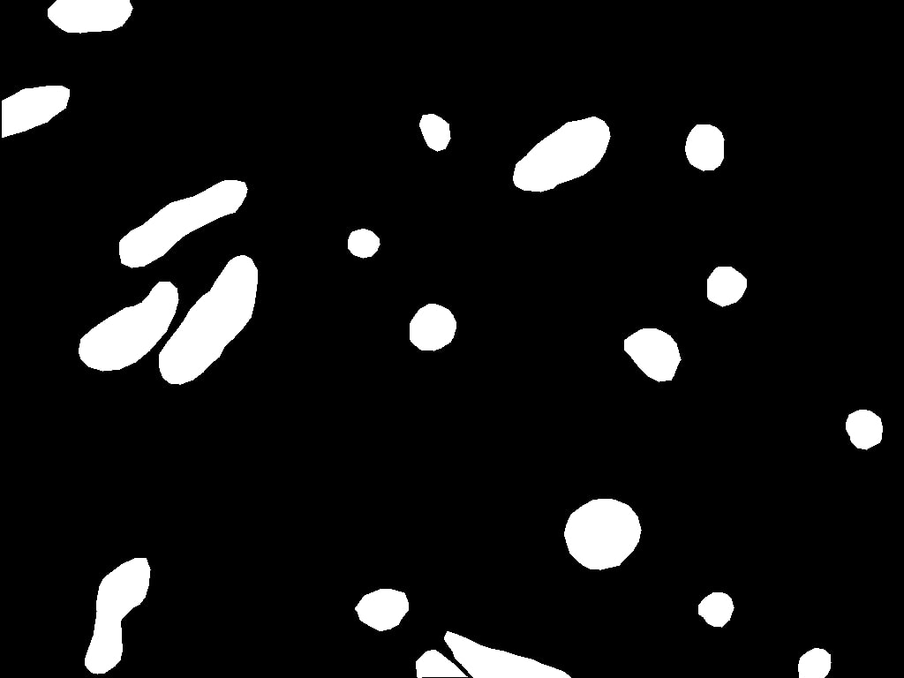

The goal is to segment automatically mitochondria in EM images as described in Semantic segmentation. This is a semantic segmentation problem where pairs of EM image and its corresponding mitochodria mask are provided. Our purpose is to segment automatically other mitochondria in images not used during train labeling each pixel with the corresponding class: background or foreground (mitochondria in this case). As an example, belown are shown two images from EPFL Hippocampus dataset used in this work:

<div class="row">
    
    
</div>
<br>

Citation:

```
Franco-Barranco, Daniel, Arrate Muñoz-Barrutia, and Ignacio Arganda-Carreras. "Stable deep neural network architectures for mitochondria segmentation on electron microscopy volumes." Neuroinformatics 20.2 (2022): 437-450.
```